# IDM Metrics Collector 1.0.0

[![GitHub Release][releases-shield]][releases]
[![Downloads][downloads-shield]][releases]
[![License][license-shield]](LICENSE)
[![Discord][discord-shield]][discord]
[![Community Forum][forum-shield]][forum]

> **Die professionelle Monitoring-Lösung für IDM Wärmepumpen**
>
> Echtzeit-Überwachung, Langzeitanalyse, intelligentes Alerting und vollständige Steuerung - alles in einer Docker-basierten All-in-One Lösung.


<details>
<summary>📸 <b>Screenshots & Galerie</b> (Klicken zum Ausklappen)</summary>
<br>

| Übersicht | Steuerung |
|:---:|:---:|
| 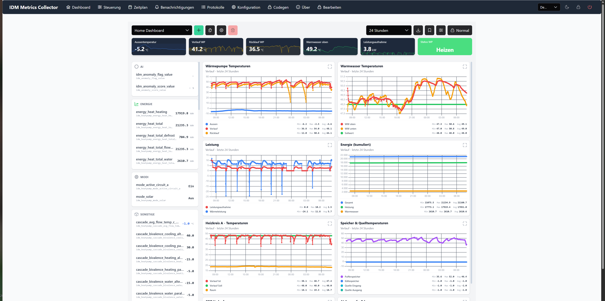 | 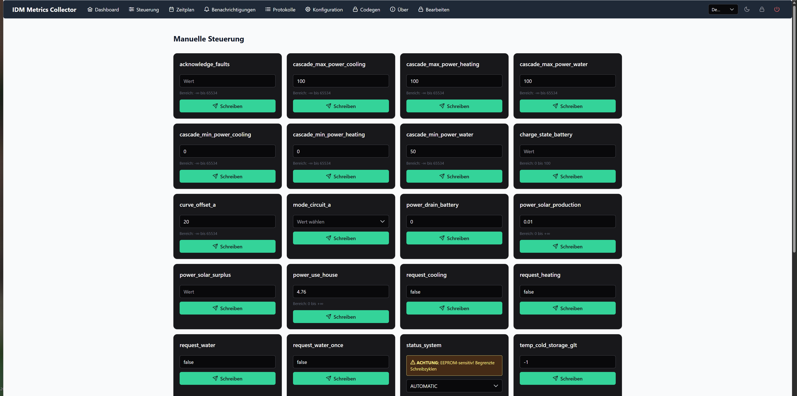 |

| Zeitplan | Protokolle |
|:---:|:---:|
| 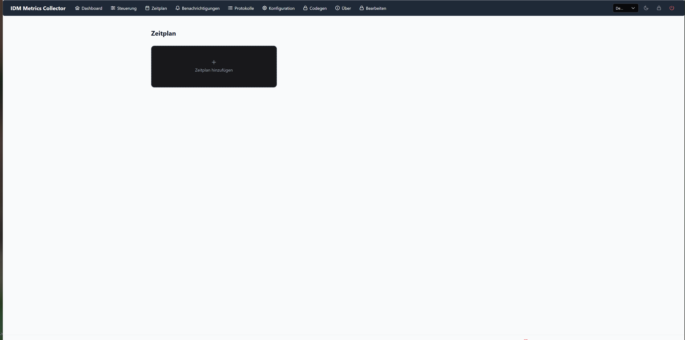 | 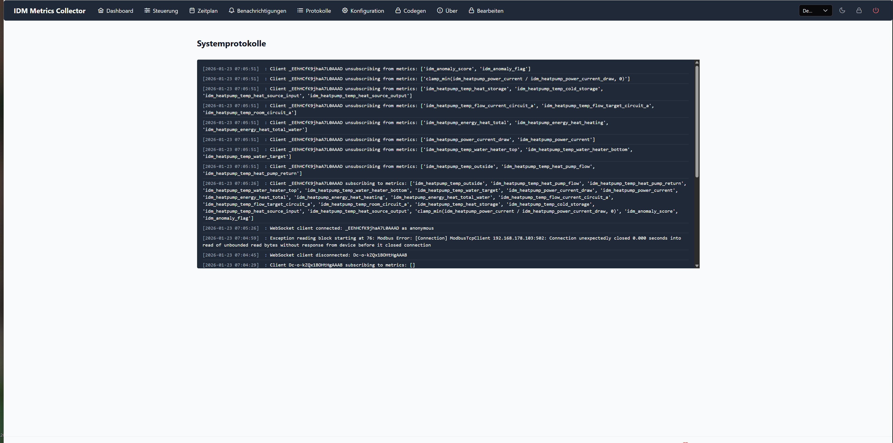 |

| Benachrichtigung | Alarm |
|:---:|:---:|
|  | 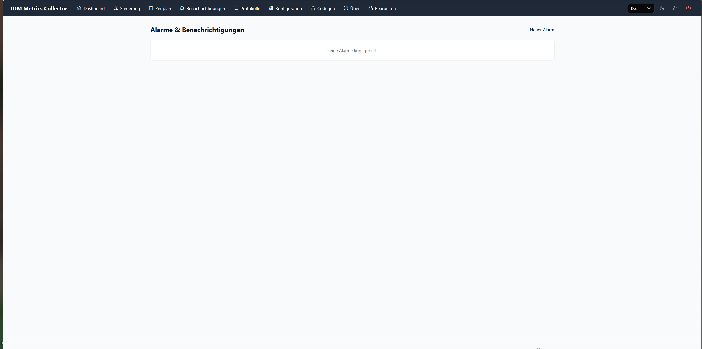 |

| KI Anomalie | Einstellung |
|:---:|:---:|
| 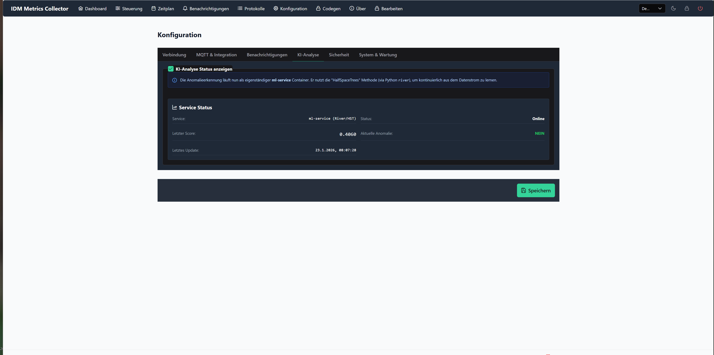 | 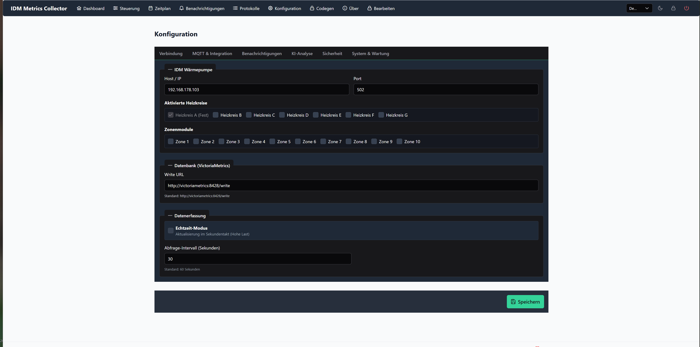 |

| MQTT | Wartung |
|:---:|:---:|
| 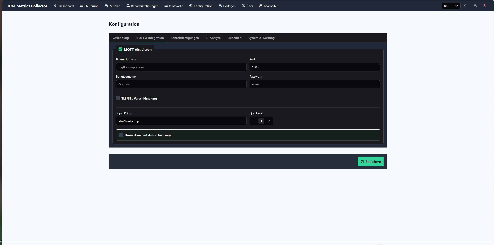 | 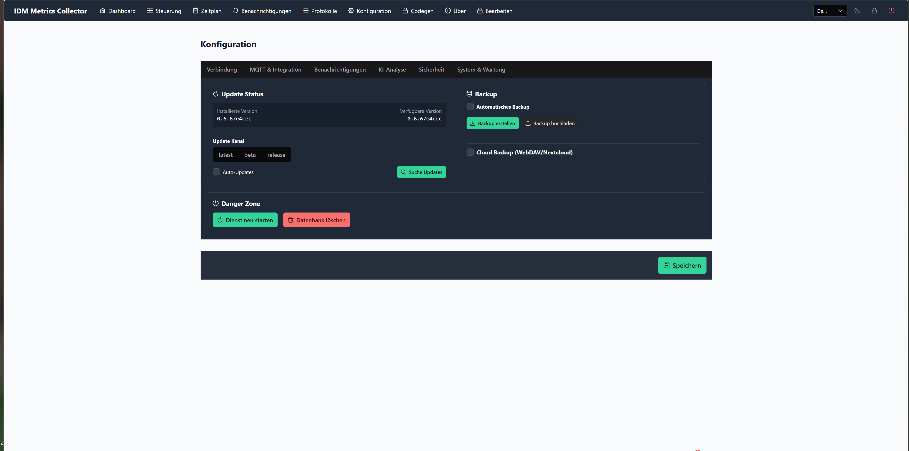 |

| Tools | Login |
|:---:|:---:|
| 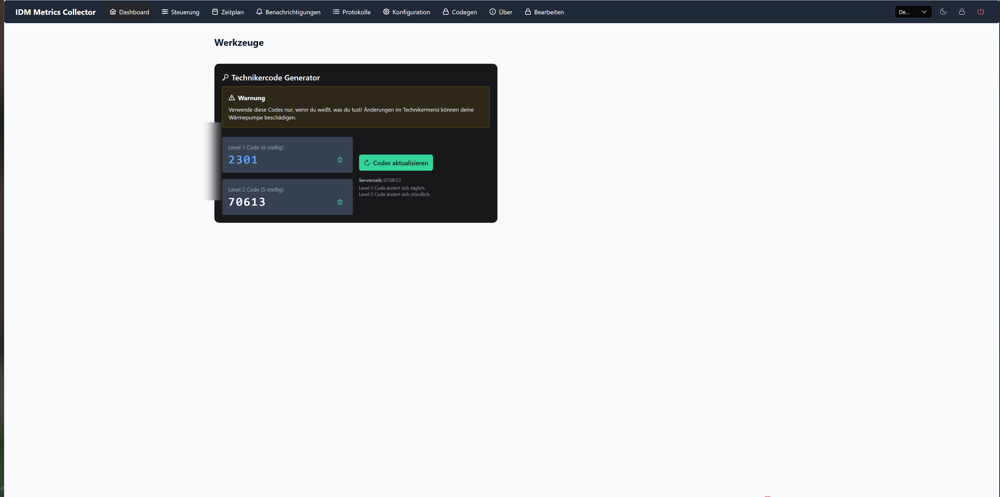 | 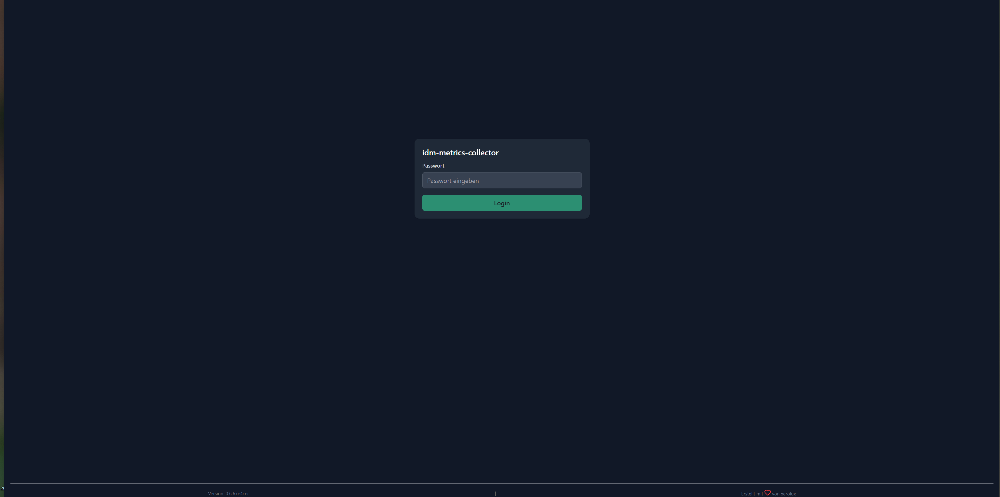 |

</details>

---

## 🎯 Warum IDM Metrics Collector?

Die integrierte Grafana-Lösung ist Vergangenheit. **Version 1.0.0** bringt ein leistungsstarkes, eigenständiges Dashboard mit ~80% Feature-Parität zu Grafana - aber einfacher, schneller und perfekt integriert.

### ✨ Highlights v1.0.0

- 🎨 **Modernes Dashboard** mit Drag & Drop, Zoom & Dark Mode
- 📊 **Dual Y-Achsen** für Temperatur + Leistung in einem Chart
- 🎯 **Stat & Gauge Panels** für Soll/Ist Vergleiche
- 📋 **Chart Templates** - One-Click Dashboards für alle Anwendungsfälle
- 🔔 **KI-Anomalie-Erkennung** warnt bei abnormalem Verhalten
- 🌙 **Dark Mode** mit System-Preference-Unterstützung
- ⚡ **Zoom & Pan** für detaillierte Analyse

---

## 📖 Dokumentation

Wir legen Wert auf erstklassige Dokumentation:

- 📄 **[Handbuch (PDF)][docs-pdf]** - Ausführliche Bedienungsanleitung
- 📚 **[Online Dokumentation][docs-online]** - Vollständige Feature-Referenz
- 🆕 **[Feature-Dokumentation][features]** - Alle neuen Features v1.0.0 im Detail

---

## 🚀 Schnellstart

### Voraussetzungen

- Docker & Docker Compose
- Netzwerkverbindung zur IDM Wärmepumpe (Navigator 2.0)

### Installation & Start

```bash
# Klonen
git clone https://github.com/Xerolux/idm-metrics-collector.git
cd idm-metrics-collector

# Starten
docker compose up -d

# Einrichten im Browser
# http://<deine-ip>:5008
```

### Ersteinrichtung

1. **IP der Wärmepumpe** eingeben
2. **Sicheres Passwort** vergeben (min. 6 Zeichen)
3. **Fertig!** Das Dashboard ist sofort live

---

## ✨ Funktionen im Detail

### 🖥️ Dashboard

Das Herzstück der Anwendung - alles auf einen Blick.

**Kernfunktionen:**
- **Live-Daten**: Außentemperatur, Vorlauf, Rücklauf, Speicher, Warmwasser
- **Drag & Drop**: Widgets beliebig anordnen
- **Zoom & Pan**: Mausrad oder Drag zum Zoomen, Ctrl+Drag zum Verschieben
- **Dual Y-Achsen**: Temperatur (links) + Leistung (rechts) in einem Chart
- **Vollbildmodus**: Jeder Chart im Fullscreen
- **Dark Mode**: Automatisch oder manuell umschaltbar

**Panel-Typen:**
- **Line Charts**: Zeitverläufe mit beliebig vielen Serien
- **Stat Panels**: Einzelwerte als große Zahlen mit Trend-Anzeige
- **Gauge Panels**: Tachometer für COP, Effizienz, etc.

**Templates (v1.0.0):**
- Temperaturübersicht
- Leistungsanalyse
- Effizienz-Monitor
- Heizkreis Detail
- Warmwasser-Monitor
- Solar-Integration
- ...und mehr

### 🎛️ Steuerung (Control)

Volle Kontrolle über deine Wärmepumpe.

- **Betriebsmodi**: Heizen, Kühlen, Auto, Eco
- **Temperaturen**: Sollwerte für Heizkreise und Warmwasser
- **Sofort-Aktionen**: Einmalige Warmwasserladung per Klick
- **EEPROM-Schutz**: Warnung bei zyklischen Schreibzugriffen

### 📅 Zeitpläne (Schedule)

Intelligente Automatisierung für Komfort und Effizienz.

- **Wochenpläne**: Individuelle Pläne für jeden Wochentag
- **Drag & Drop**: Intuitive Bedienung
- **Mehrfach-Trigger**: Verschiedene Aktionen zu verschiedenen Zeiten

### 🔔 Benachrichtigungen & KI (Alerts)

Das System wacht über deine Anlage - 24/7.

**Alert-Typen:**
- **Schwellwert-Alerts**: Temperatur/Druck überschritten
- **Status-Alerts**: Verdichter aus, Fehlermeldung, etc.
- **KI-Anomalien**: Maschinelles Lernen erkennt abnormales Verhalten

**Kanäle:**
- Push (ntfy), MQTT, Telegram, Signal, Discord, E-Mail, WebDAV

### ⚙️ Konfiguration (Config)

Alles an einem Ort.

- **Verbindung**: Modbus-Parameter
- **Heizkreise**: A, B, C aktivieren
- **MQTT**: Home Assistant Integration
- **Benachrichtigungen**: Alle Kanäle konfigurieren
- **Backup**: Automatische Backups mit WebDAV-Upload
- **Netzwerk**: IP-Whitelist/Blacklist
- **Updates**: Automatisch oder manuell

### 📜 Logs (Logs)

Behalte den Überblick.

- **Echtzeit-Logs**: Alle Systemereignisse live
- **Filterbare Ansicht**: Modbus, Scheduler, Web, Alerts
- **Farbcodierung**: Info, Warning, Error

### 🔧 Tools & Service

Für Profis und Technik-Fans.

- **Techniker-Codes**: Temporäre Fachmann-Codes generieren
- **System-Check**: Gesundheit aller Dienste

### ℹ️ Über (About)

Systeminformationen auf einen Blick.

- Version, Links, Dokumentation, Support

---

## 🆕 Was ist neu in v1.0.0?

### Dashboard Revolution

| Feature | v0.6.0 | v1.0.0 |
|---------|--------|--------|
| Chart Zoom | ❌ | ✅ Mausrad, Drag, Pinch |
| Tooltips | Basic | ✅ Deutsch, formatiert, farbig |
| Dual Y-Achsen | ❌ | ✅ Temperatur + Leistung |
| Stat Panels | ❌ | ✅ Mit Trend & Soll/Ist |
| Gauge Panels | ❌ | ✅ Tachometer mit Zonen |
| Dark Mode | ❌ | ✅ System-Preference |
| Templates | ❌ | ✅ 7+ One-Click Templates |
| Export | ❌ | ❌ (geplant v0.8.0) |

### Neue Components

```vue
<!-- Stat Panel für Einzelwerte -->
<StatCard
    title="Außentemperatur"
    query="idm_heatpump_temp_outside"
    unit="°C"
    :show-trend="true"
    :show-target="true"
/>

<!-- Gauge Panel für COP -->
<GaugeCard
    title="COP"
    query="idm_heatpump_cop"
    :min="0"
    :max="10"
    :show-zones="true"
/>

<!-- Chart mit Dual Y-Achse -->
<ChartCard
    title="Temp & Leistung"
    :queries="[
        { label: 'Vorlauf', query: 'temp_flow', color: '#ef4444' },
        { label: 'Leistung', query: 'power', color: '#3b82f6' }
    ]"
    y-axis-mode="dual"
/>
```

---

## 📊 Dashboard vs. Grafana

Warum wir das integrierte Dashboard dem externen Grafana vorziehen:

| Aspect | Dashboard | Grafana |
|--------|-----------|---------|
| **Installation** | ✅ Inklusive | ❌ Zusätzlich erforderlich |
| **Konfiguration** | ✅ Plug & Play | ❌ Manual setup |
| **Updates** | ✅ Automatisch | ❌ Getrennt |
| **Performance** | ✅ Optimiert | ⚠️ Resource-hungrig |
| **Mobile** | ✅ Responsive | ⚠️ Eingeschränkt |
| **Features** | ✅ ~80% Parität | ✅ 100% |
| **Integration** | ✅ Native | ❌ Separat |

**Fazit:** Für 95% der Anwendungsfälle ist das Dashboard vollkommen ausreichend - und deutlich einfacher zu handhaben.

---

## 🔧 Technische Details

### Stack

**Backend:**
- Python 3.11+
- Flask + Waitress (Production Server)
- Modbus TCP (pymodbus)
- VictoriaMetrics (Time Series Database)

**Frontend:**
- Vue 3 + Composition API
- PrimeVue (UI Components)
- Chart.js + vue-chartjs
- Tailwind CSS 4

**Docker:**
- Multi-stage build
- Alpine-based images
- Automatic restart policies

### Performance

- **Polling**: 60 Sekunden (konfigurierbar)
- **Data Points**: Intelligentes Downsampling
- **Caching**: API-Responses gecacht
- **Bundle Size**: ~500KB gzipped

### Sicherheit

- **Passwort**: Min. 6 Zeichen, gehashed
- **Session**: HTTPOnly, SameSite=Lax
- **Rate Limiting**: 200 req/min
- **Security Headers**: CSP, X-Frame-Options, etc.
- **Network Security**: IP-Whitelist/Blacklist

---

## 🤝 Support & Community

**Fragen? Probleme? Ideen?**

- 🐛 [Issue erstellen][issues]
- 💬 [Discord Community][discord]
- 📖 [Dokumentation][docs-online]
- 🔧 [Feature Request][features]

---

## 🗺️ Roadmap

### v0.8.0 (Geplant)

- [ ] Dashboard Export (PNG/PDF)
- [ ] Math Queries (A/B, A*100)
- [ ] Variables/Templates
- [ ] Bar Charts & Heatmaps

### v0.9.0 (Geplant)

- [ ] Annotations (Markierungen)
- [ ] Custom CSS pro Dashboard
- [ ] WebSocket Live-Updates
- [ ] Shared Dashboards (Links)

### v1.0.0 (Ziel)

- [ ] 100% Feature-Parität zu Grafana
- [ ] Mobile Apps (iOS/Android)
- [ ] Cloud-Sync
- [ ] Multi-User Support

---

## 📄 Lizenz

MIT License - siehe [LICENSE](LICENSE)

---

## 🙏 Danksagung

An alle Contributer, Tester und Community-Mitglieder, die dieses Projekt möglich machen!

Besonderer Dank an:
- IDM für die offene Modbus-Spezifikation
- Die Home-Assistant-Community
- Alle Beta-Tester

---

**Viel Spaß mit deinem IDM Metrics Collector!** 🎉

<!-- Badge Links -->
[releases-shield]: https://img.shields.io/github/release/xerolux/idm-metrics-collector.svg?style=for-the-badge
[releases]: https://github.com/xerolux/idm-metrics-collector/releases
[downloads-shield]: https://img.shields.io/github/downloads/xerolux/idm-metrics-collector/latest/total.svg?style=for-the-badge
[license-shield]: https://img.shields.io/github/license/xerolux/idm-metrics-collector.svg?style=for-the-badge
[discord]: https://discord.gg/Qa5fW2R
[discord-shield]: https://img.shields.io/discord/330944238910963714.svg?style=for-the-badge
[forum-shield]: https://img.shields.io/badge/community-forum-brightgreen.svg?style=for-the-badge
[forum]: https://community.home-assistant.io/
[docs-pdf]: docs/IDM_Metrics_Collector_Handbuch.pdf
[docs-online]: docs/MANUAL.md
[features]: FEATURES.md
[issues]: https://github.com/xerolux/idm-metrics-collector/issues
