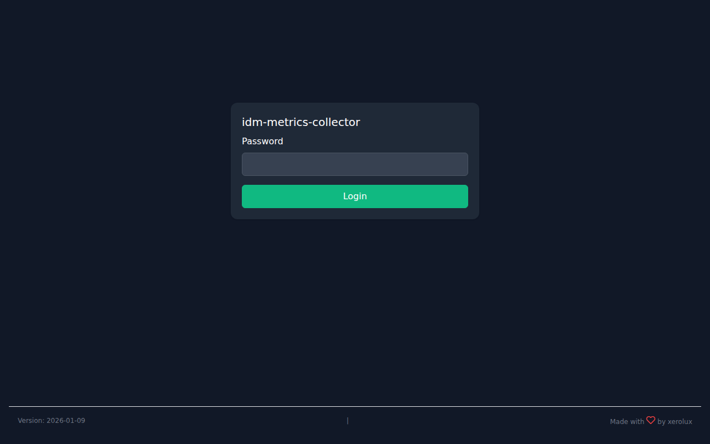
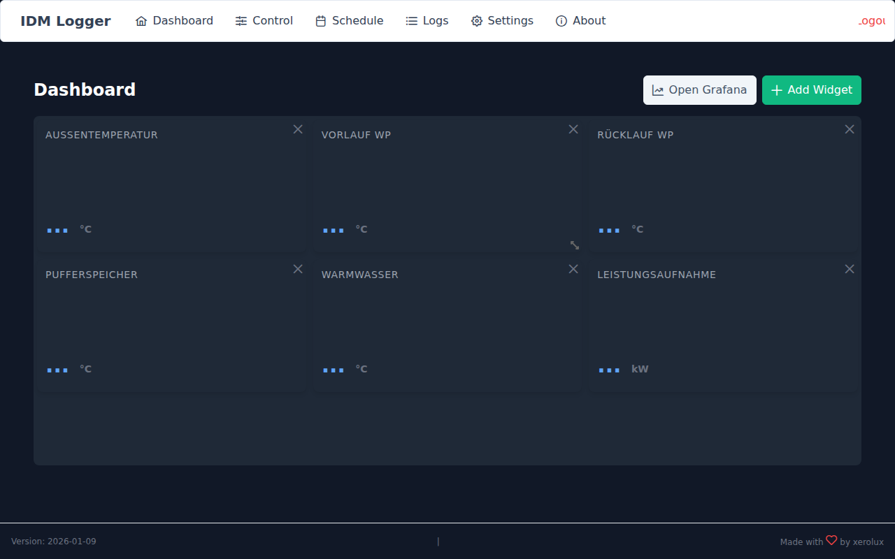
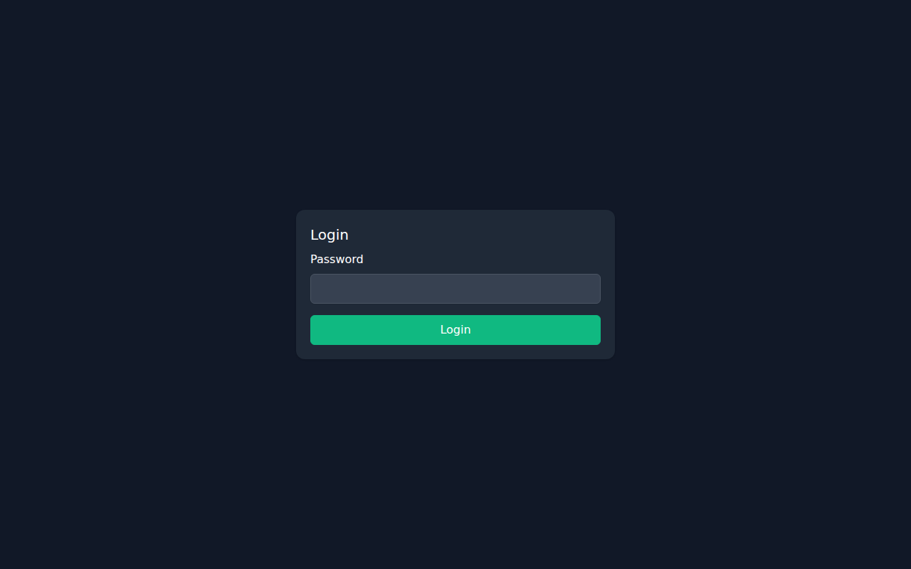
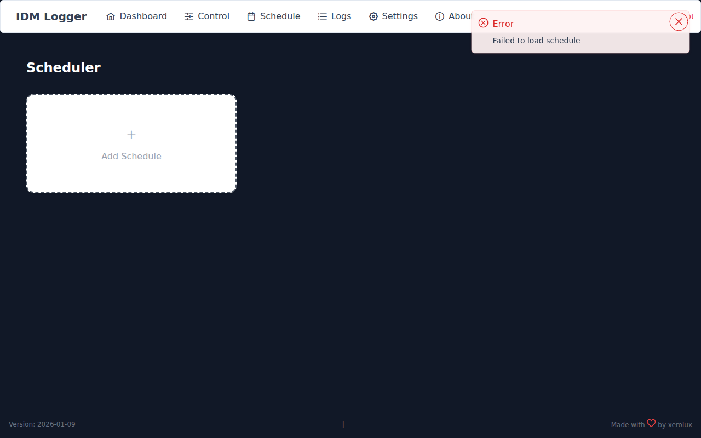
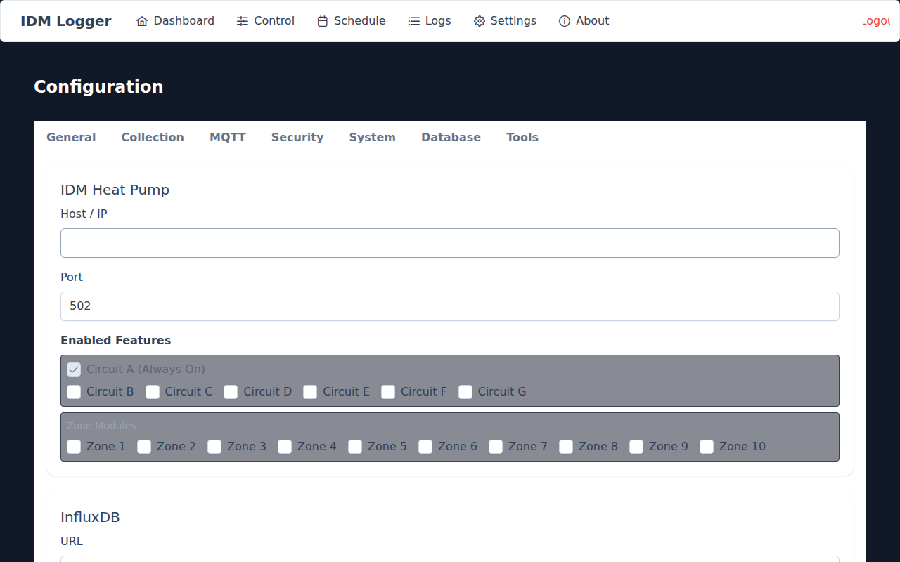
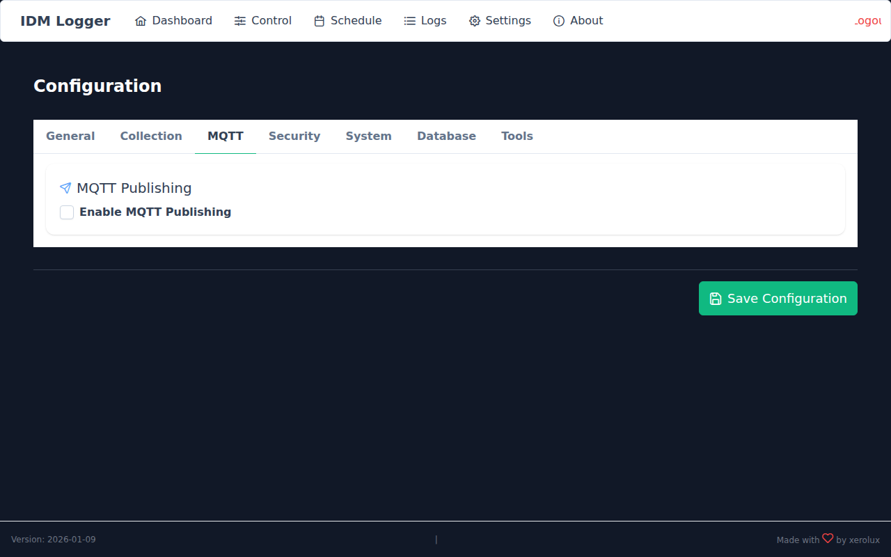
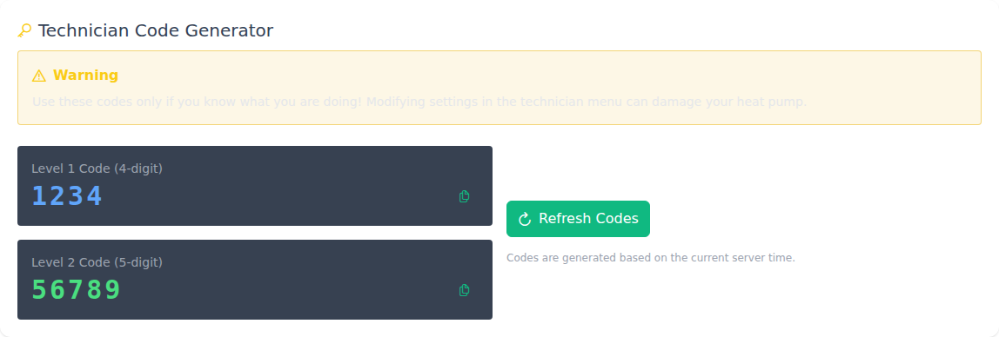
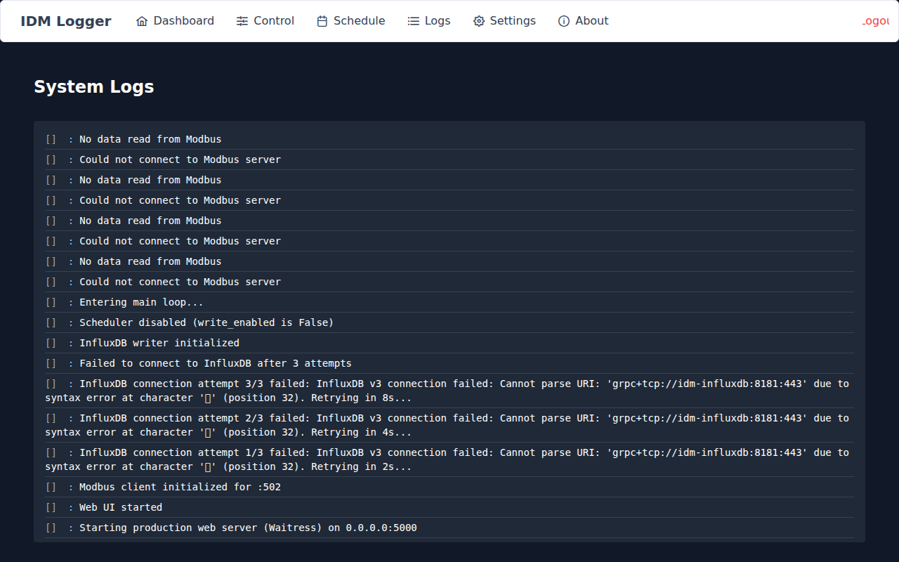

# IDM Metrics Collector v0.5.0

[![GitHub Release][releases-shield]][releases]
[![Downloads][downloads-shield]][releases]
[![GitHub Activity][commits-shield]][commits]
[![License][license-shield]](LICENSE)

[![Discord][discord-shield]][discord]
[![Community Forum][forum-shield]][forum]
[![Buy Me A Coffee][buymeacoffee-badge]][buymeacoffee]
[](https://ts.la/sebastian564489)

A comprehensive monitoring and control system for IDM Heat Pumps (Navigator 2.0) with InfluxDB v3 metrics storage and Grafana visualization.

## Features

*   **Docker-First**: Optimized for Docker and Docker Compose deployments
*   **Zero-Config Setup**: Complete stack with InfluxDB v3 and Grafana pre-configured
*   **Automated Installer**: One command installation handles everything
*   **Data Source**: Reads from IDM Heat Pump via Modbus TCP
*   **Data Sink**: InfluxDB v3 Core with SQL query support
*   **Web Interface**: Modern dashboard for live data, configuration, manual control, and scheduling
*   **Automation**: Built-in scheduler to write values (e.g., temperatures) at specific times
*   **Production Ready**: Health checks, automatic restarts, persistent data

## Quick Start

### One-Command Installation

```bash
curl -fsSL https://raw.githubusercontent.com/Xerolux/idm-metrics-collector/main/install.sh | sudo bash
```

Or clone and run:

```bash
git clone https://github.com/Xerolux/idm-metrics-collector.git
cd idm-metrics-collector
sudo chmod +x install.sh
sudo ./install.sh
```

The installer will:
1. Detect your OS and install Docker/Docker Compose
2. Install required dependencies (git, curl, etc.)
3. Ask you to choose installation method:
   - **Docker**: Single container deployment (App only)
   - **Docker Compose**: Complete stack (App + InfluxDB + Grafana) **[RECOMMENDED]**
4. Clone repository, build images, and start all services

### Installation Methods

#### Option 1: Docker (Single Container)

Best for: Connecting to existing InfluxDB instance

```bash
sudo ./install.sh
# Choose option 1: Docker
```

After installation:
```bash
# Edit configuration
sudo nano /opt/idm-metrics-collector/config.yaml

# Restart container
docker restart idm-metrics-collector

# View logs
docker logs -f idm-metrics-collector
```

#### Option 2: Docker Compose (Full Stack) **[RECOMMENDED]**

Best for: Complete turnkey solution with monitoring

```bash
sudo ./install.sh
# Choose option 2: Docker Compose
```

This installs:
- **IDM Metrics Collector** (Web UI + API)
- **InfluxDB v3 Core** (Time-series database with SQL support)
- **Grafana** (Visualization platform with InfluxDB v3 integration)

All services are pre-configured and ready to use!

After installation:
```bash
# Edit configuration (set your heat pump IP)
sudo nano /opt/idm-metrics-collector/config.yaml

# Restart stack
cd /opt/idm-metrics-collector && docker compose restart
```

## Accessing Services

### After Installation

**Web UI** (IDM Metrics Collector)
- URL (Docker Compose default): `http://your-server-ip:5008`
- URL (single container default): `http://your-server-ip:5000`
- Default Login: `admin` / `admin` (change after first login)
- Features: Live dashboard, control panel, scheduling, configuration

**Grafana** (Docker Compose only)
- URL: `http://your-server-ip:3001`
- Default Login: `admin` / `admin`
- Pre-configured with InfluxDB datasource and IDM dashboard

**InfluxDB v3** (Docker Compose only)
- URL: `http://your-server-ip:8181`
- Default Configuration:
  - Database: `idm`
  - Token: `my-super-secret-token-change-me`
  - Query Language: SQL (replaces Flux from v2)
  - Note: Database is auto-created on first write

### Docker Image (GHCR)

Pre-built images are available from GitHub Container Registry:

```bash
docker pull ghcr.io/xerolux/idm-metrics-collector:latest
docker run --rm -p 5000:5000 \
  -v $(pwd)/data:/app/data \
  ghcr.io/xerolux/idm-metrics-collector:latest
```

Images are automatically built on:
- Pushes to `main` branch (tagged as `latest`)
- Git tags starting with `v` (e.g., `v1.0.0`)

## Configuration

Configuration file location: `/opt/idm-metrics-collector/config.yaml`

Example:

```yaml
idm:
  host: "192.168.1.100"  # IP of your IDM Heat Pump
  port: 502              # Modbus Port
  circuits: ["A"]        # Enabled heating circuits

influx:
  url: "http://localhost:8181"
  database: "idm"
  token: "my-token"

web:
  enabled: true
  port: 5000
  admin_password: "admin" # Password for login
  write_enabled: false    # Enable writing to heat pump (Control/Schedule)

logging:
  interval: 60           # Seconds between reads
  level: "INFO"
```

## Web Interface

Access the web interface at `http://<your-server-ip>:5008` when using Docker Compose, or `http://<your-server-ip>:5000` for the single-container setup.

*   **Login**: The interface is protected by a password (default: `admin`).
    

*   **Live Dashboard**: Shows categorized sensor values with auto-refresh and customizable widgets.
    

*   **Control**: (If enabled) Write values to writable sensors.
    

*   **Schedule**: (If enabled) Automate setting values based on time and day.
    

*   **Configuration**:
    *   **General**: Configure IDM connection, InfluxDB, and logging.
        
    *   **MQTT**: Setup MQTT publishing and Home Assistant discovery.
        
    *   **Tools**: Generate technician codes and manage database.
        

*   **Logs**: View live system logs.
    

*   **Solar Integration**: Write PV surplus to the heat pump via MQTT. See [SOLAR_INTEGRATION.md](docs/SOLAR_INTEGRATION.md).

## Usage & Disclaimer

Use this project as-is and at your own risk. Ensure you understand the implications of reading from or writing to your heat pump before enabling control features.

## License

MIT License. See [LICENSE](LICENSE).

---

This project is not affiliated with or endorsed by IDM Energiesysteme GmbH and is provided independently.

<!-- Badge Links -->
[releases-shield]: https://img.shields.io/github/release/xerolux/idm-metrics-collector.svg?style=for-the-badge
[releases]: https://github.com/xerolux/idm-metrics-collector/releases
[downloads-shield]: https://img.shields.io/github/downloads/xerolux/idm-metrics-collector/latest/total.svg?style=for-the-badge
[commits-shield]: https://img.shields.io/github/commit-activity/y/xerolux/idm-metrics-collector.svg?style=for-the-badge
[commits]: https://github.com/xerolux/idm-metrics-collector/commits/main
[license-shield]: https://img.shields.io/github/license/xerolux/idm-metrics-collector.svg?style=for-the-badge
[discord]: https://discord.gg/Qa5fW2R
[discord-shield]: https://img.shields.io/discord/330944238910963714.svg?style=for-the-badge
[forum-shield]: https://img.shields.io/badge/community-forum-brightgreen.svg?style=for-the-badge
[forum]: https://community.home-assistant.io/
[buymeacoffee]: https://www.buymeacoffee.com/xerolux
[buymeacoffee-badge]: https://img.shields.io/badge/buy%20me%20a%20coffee-donate-yellow.svg?style=for-the-badge
