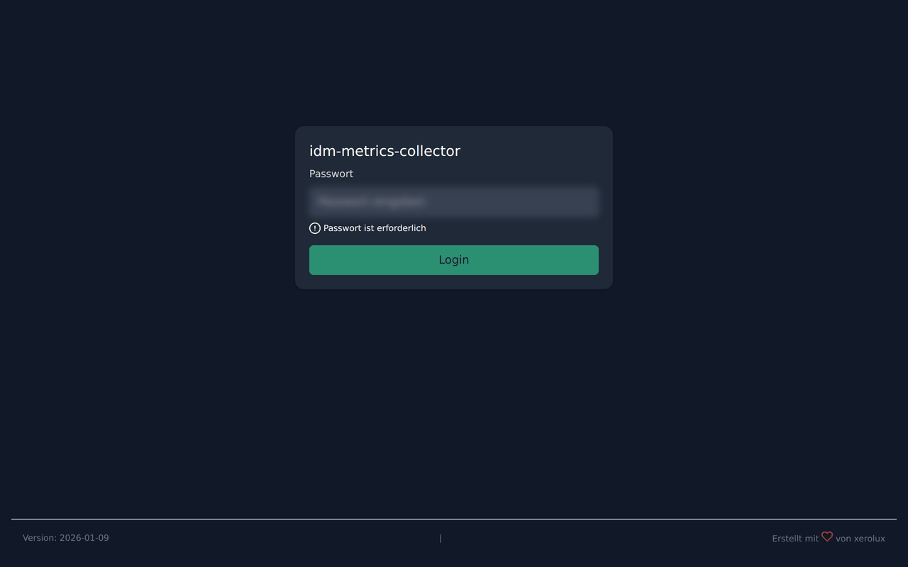
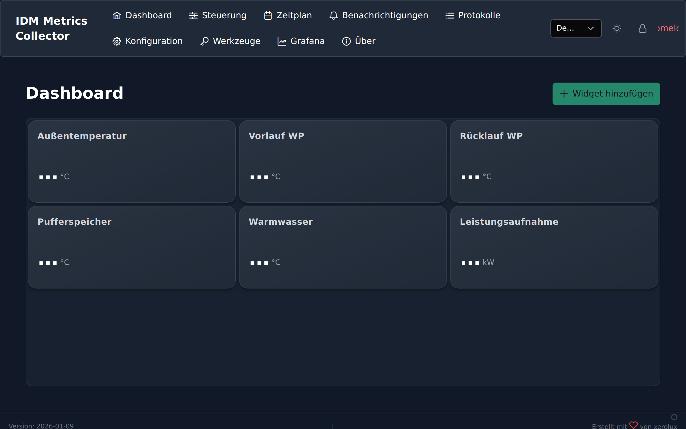
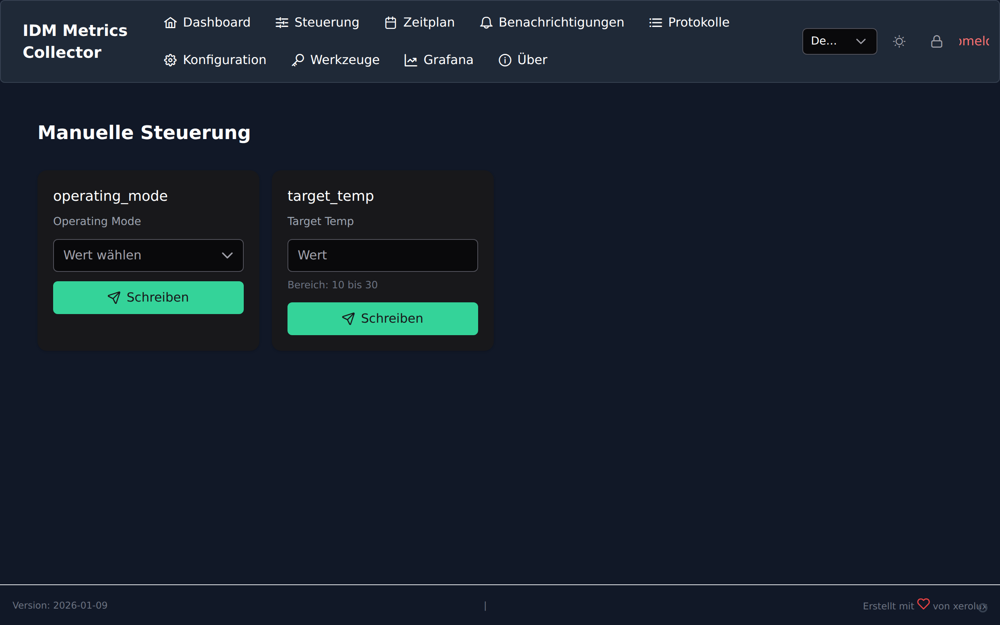
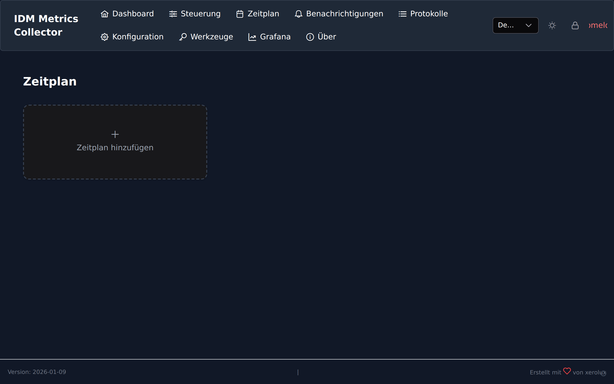
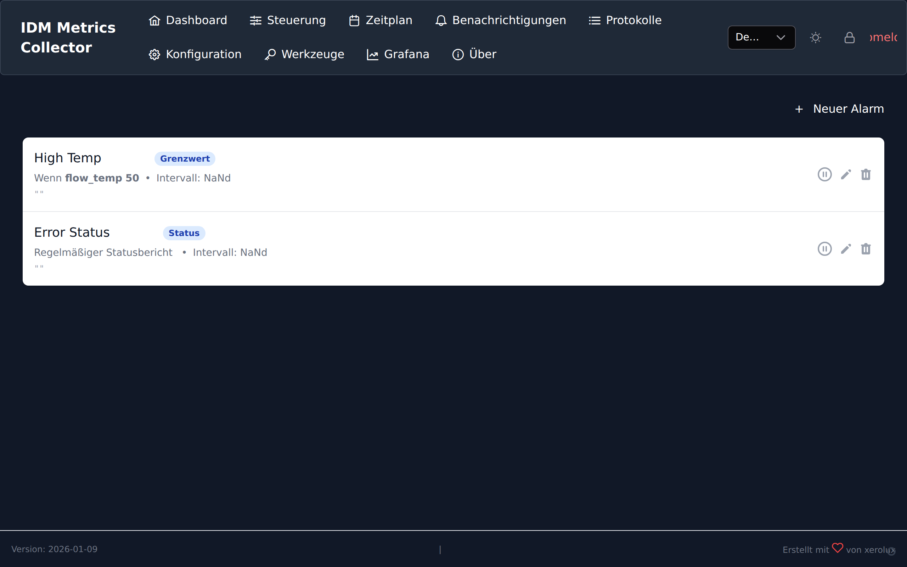
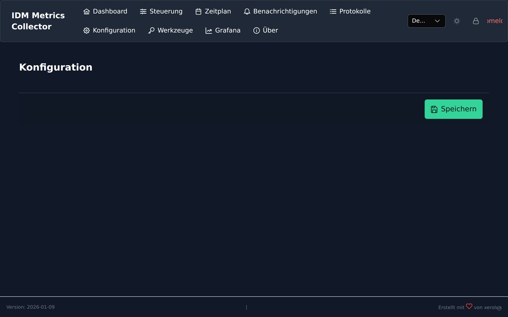

# IDM Metrics Collector 0.6.0

[![GitHub Release][releases-shield]][releases]
[![Downloads][downloads-shield]][releases]
[![GitHub Activity][commits-shield]][commits]
[![License][license-shield]](LICENSE)

[![Discord][discord-shield]][discord]
[![Community Forum][forum-shield]][forum]
[![Buy Me A Coffee][buymeacoffee-badge]][buymeacoffee]
[](https://ts.la/sebastian564489)

**Die Komplettlösung für deine IDM Wärmepumpe.**

Überwache, steuere und automatisiere deine Wärmepumpe (Navigator 2.0) bequem über den Browser. Eine Docker-basierte Anwendung, die alles vereint: Live-Monitoring, Langzeit-Datenspeicherung und professionelle Analyse-Tools.

> **Kompatibilität**
>
> Entwickelt und getestet für **IDM Wärmepumpen mit Navigator 2.0**.
> Nutzt die standardisierte Modbus TCP Schnittstelle.

---



## ✨ Funktionen

### 🖥️ Dashboard
Alles auf einen Blick. Das Dashboard zeigt dir in Echtzeit die wichtigsten Werte deiner Anlage.
*   **Live-Daten:** Außentemperatur, Vorlauf, Pufferspeicher und Warmwasser.
*   **Statusanzeige:** Siehe sofort, ob Heizkreise aktiv sind, der Verdichter läuft oder Warmwasser bereitet wird.
*   **Anpassbar:** Füge Widgets hinzu oder verschiebe sie nach deinen Wünschen.



### 🎛️ Steuerung (Control)
Nimm das Steuer selbst in die Hand. Ändere Betriebsmodi und Temperaturen direkt aus der App.
*   **Betriebsmodus:** Wechsle zwischen Heizen, Kühlen, Auto oder Eco.
*   **Temperaturen:** Passe die Soll-Werte für Heizkreise und Warmwasser an.
*   **Sofort-Aktionen:** Einmalige Warmwasserladung per Klick starten.



### 📅 Zeitpläne (Schedule)
Intelligente Automatisierung für mehr Komfort und Effizienz.
*   **Wochenplan:** Erstelle individuelle Heiz- und Warmwasserpläne für jeden Wochentag.
*   **Einfache Bedienung:** Intuitive Drag-and-Drop Oberfläche.



### 🔔 Benachrichtigungen & KI (Alerts)
Das System wacht über deine Anlage.
*   **Störungsmelder:** Erhalte Push-Benachrichtigungen (via ntfy, MQTT, etc.) bei Fehlern.
*   **KI-Analyse:** Die integrierte Anomalie-Erkennung lernt das Verhalten deiner Anlage und warnt bei Abweichungen.



### 🔧 Tools & Service
Nützliche Werkzeuge für Profis und Eigentümer.
*   **Code Generator:** Erzeuge temporäre Fachmann- oder Technikercodes für tiefergehende Einstellungen am Navigator Panel.
*   **System Logs:** Detaillierte Einblicke in die Kommunikation mit der Wärmepumpe.


### 📊 Langzeit-Analyse (Grafana)
Für alle Daten-Liebhaber ist ein voll konfiguriertes Grafana Dashboard integriert.
*   **Historie:** Analysiere Temperaturverläufe über Monate und Jahre.
*   **Performance:** Überwache den COP und Energieverbrauch.

---

## 🚀 Installation & Start

Die Installation erfolgt am einfachsten via Docker.

### Voraussetzungen
*   Docker & Docker Compose installiert.
*   Netzwerkverbindung zur IDM Wärmepumpe.

### Schritt 1: Starten

```bash
git clone https://github.com/Xerolux/idm-metrics-collector.git
cd idm-metrics-collector
docker compose up -d
```

### Schritt 2: Einrichten

Öffne `http://<deine-ip>:5008` im Browser.

1.  **Login:** Melde dich mit `admin` / `admin` an.
2.  **Passwort ändern:** Aus Sicherheitsgründen wirst du aufgefordert, sofort ein neues Passwort zu vergeben.
3.  **Konfiguration:** Gehe zu "Einstellungen" (Config) und trage die IP-Adresse deiner Wärmepumpe ein.



---

## ⚙️ Konfiguration

In den Einstellungen kannst du das System an deine Bedürfnisse anpassen:

*   **Verbindung:** IP-Adresse und Modbus-Parameter.
*   **Heizkreise:** Aktiviere die Heizkreise, die du nutzen möchtest (A, B, C...).
*   **Schreibrechte:** Aktiviere "Write Access", wenn du die Steuerung nutzen möchtest.
*   **Backup:** Automatische Backups deiner Einstellungen und Datenbank.

## ⚠️ Wichtige Hinweise

*   **Sicherheit:** Ändere das Standard-Passwort sofort nach der Installation. Das System zwingt dich dazu, diesen Schritt nicht zu überspringen.
*   **Haftung:** Dies ist ein privates Projekt. Die Nutzung erfolgt auf eigene Gefahr. Sei vorsichtig beim Ändern von Parametern an der Heizung.

## 🤝 Support

Probleme? Fragen? Ideen?

*   🐛 [Issue erstellen](https://github.com/xerolux/idm-metrics-collector/issues)
*   💬 [Discord Community][discord]

---
License: MIT

<!-- Badge Links -->
[releases-shield]: https://img.shields.io/github/release/xerolux/idm-metrics-collector.svg?style=for-the-badge
[releases]: https://github.com/xerolux/idm-metrics-collector/releases
[downloads-shield]: https://img.shields.io/github/downloads/xerolux/idm-metrics-collector/latest/total.svg?style=for-the-badge
[commits-shield]: https://img.shields.io/github/commit-activity/y/xerolux/idm-metrics-collector.svg?style=for-the-badge
[commits]: https://github.com/xerolux/idm-metrics-collector/commits/main
[license-shield]: https://img.shields.io/github/license/xerolux/idm-metrics-collector.svg?style=for-the-badge
[discord]: https://discord.gg/Qa5fW2R
[discord-shield]: https://img.shields.io/discord/330944238910963714.svg?style=for-the-badge
[forum-shield]: https://img.shields.io/badge/community-forum-brightgreen.svg?style=for-the-badge
[forum]: https://community.home-assistant.io/
[buymeacoffee]: https://www.buymeacoffee.com/xerolux
[buymeacoffee-badge]: https://img.shields.io/badge/buy%20me%20a%20coffee-donate-yellow.svg?style=for-the-badge
